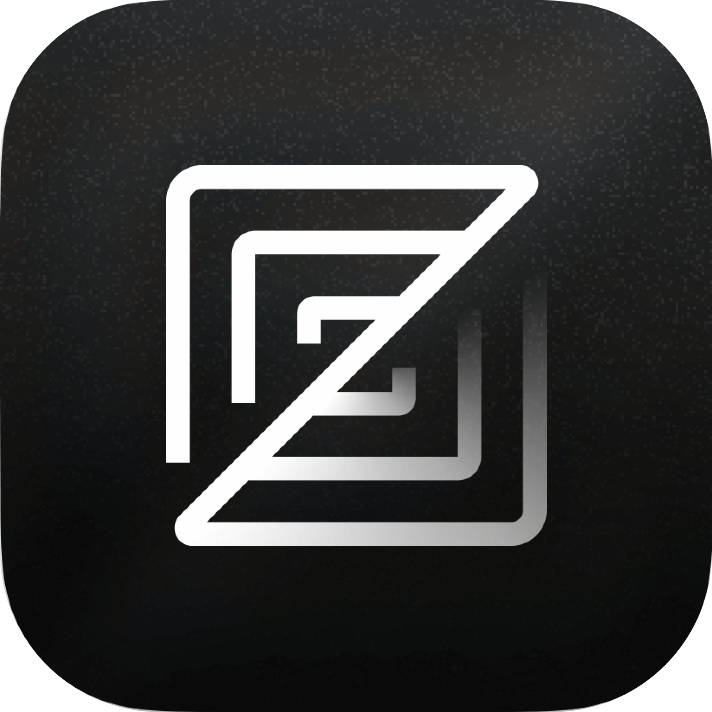
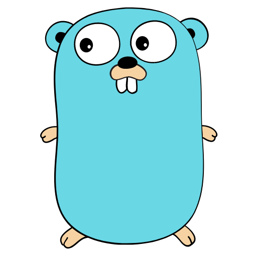
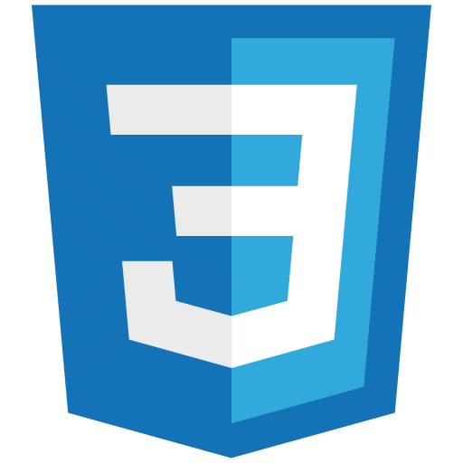
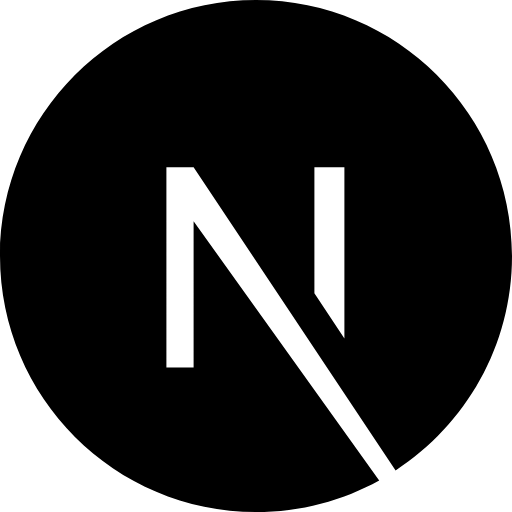
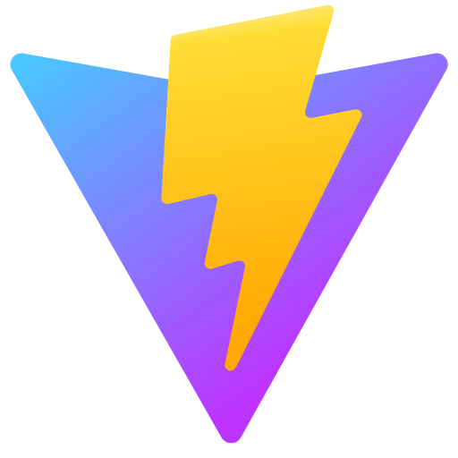
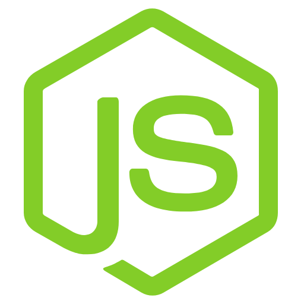
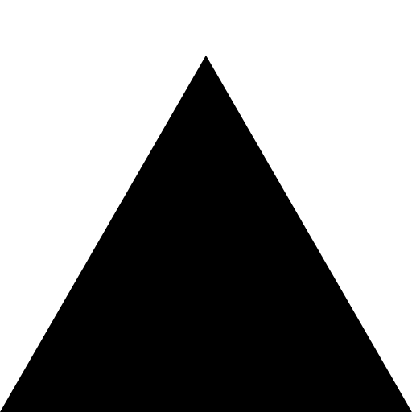

<!-- markdownlint-disable MD033 MD013 -->
  <p align="center">
    
  </p>

  <h1 align="center">
    You can reach me here ⬇️
  </h1>

  <p align="center">
    <a href="https://portfolio-steel-kappa-78.vercel.app/" target="_blank">
      
    </a>
    <a href="https://www.linkedin.com/in/carlos-acosta-7aa448263/" target="_blank">
      
    </a>
    <a href="https://x.com/carlosaac23" target="_blank">
      
    </a>
    <a href="mailto:carlosaac232001@gmail.com" target="_blank">
      
    </a>
  </p>

---

  <h2> 👨🏻‍💻 &nbsp;About Me</h2>
  
  ```yaml
  name: Carlos Acosta
  located_in: Valledupar, Colombia
  current_job: Software Developer
  education:
    [
      "Self-Taught Developer",
      "Degree in Systems Engineering (Start in august 2026)",
    ]
  
  fields_of_interests:
    [
      "Web Development",
      "Backend Development",
    ]
  technical_background:
    [
      "Full Stack Developer"
    ]
    
  currently_learning: ["Go and Docker"]
  hobbies: ["Gaming", "Movies", "Gym", "Reading"]
  ```
  
  ---

<h2> 🚀 &nbsp;Some Tools I Use</h2>
<p align="center">
  
  
  
  
  
  
  
  
  
  
  
  
  
  
  
  
  
  
  
  
  
</p>

<p align="center">
  
</p>

<!-- markdownlint-disable MD033 -->
